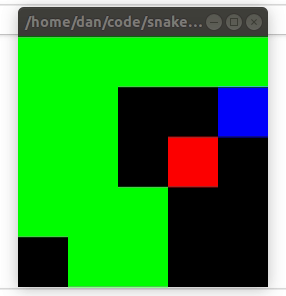

# Solving Snake with Deep RL

## Installation

Issue

```
pipenv install --skip-lock
```

in the top-level directory to create a Python virtualenv with the required dependencies. Run

```
pipenv shell
```

to start a shell in the virtualenv.

## Human-playable Mode

Issue

```
python -m snake.human
```

to play-test the Snake gym environment, controlling the snake by entering "l", "r", "u", or "d"
for left, right, up, or down commands, respectively. The snake's head (blue) is moved by the
player. The body (green) follows suit, and grows in length by 1 block each time a fruit (red)
is consumed.

## Solving Snake with Online Advantage-Weighted Regression

[Advantage-Weighted Regression (AWR)](https://arxiv.org/abs/1910.00177) is a recent algorithmic
contribution to the reinforcement learning literature, applicable in on- or off-policy settings.
Assuming randomly initialized value (`V_\theta`) and policy (`\pi_\phi`) function approximators, the
on-policy version of the method consists of only a few simple steps iterated many times over:

1. Sample a batch of trajectories `{(s_t, a_t, r_w, s_{t + 1})}_{t = 1}^T` under policy induced
  by policy network.
2. Fit the value network to the sampled trajectories using `TD(\lambda)` (possibly with multi-step returns).
3. Fit the policy network to the scaled, per-action advantages using policy gradient.

Here, `s` refers to states, `a` to actions, `r` to rewards, and `T` to the maximum number of steps
in an episode.

During training, trajectories are sampled using actions sampled from the distribution induced by
the policy network (namely, a multivariate Gaussian will diagonal covariance matrix). However, at
evaluation time, actions are computed as the _mode_ of the distribution induced by the policy
network. This is a common strategy for implementing _exploration_ vs. _exploitation_ in RL.

To run AWR on the Snake environment, run

```
python -m snake.awr --job-dir [path/to/job/directory]
```

This will train a 3-layer MLP agent with ReLU activations to solve the 8x8 board version of Snake.
To train a convolutional neural network (CNN) agent, simply supply the `--conv` flag to the above
command. To render the game during training / evaluation, use the `--render` flag. Other important
flags include `--seed [integer]` (random seed for reproducibility purposes), `--n-iters [integer]`
(no. of training iterations), `--batch-size [integer]`, (no. of parallel training / evaluation
episodes), and `--max-steps [integer]` (maximum no. of time steps per episode). Consult the source
code for the use of additional command-line arguments.

## Results

Below is an example video of the snake (blue head, green body) playing Snake on a 5x5 board nearly
perfectly by collecting enough fruit (red) to almost completely fill the board. 

<p align="center">
  
</p>

## TODO

- Add support for n-step returns. At present, returns are computed from entire trajectories. This
  computation will be intractable with increasing `--side-length`, which requires larger
  `--max-steps` to beat the game.
- Add support for off-policy and batch mode versions of the algorithm. Both require a replay buffer
  to store experience, and the latter additional requires saving + loading said buffer from disk.
- Add option to use egocentric observations; i.e., observations that have a finite extent around
  the agent, meant to encourage the agent to search for the fruit when it is out-of-frame.
- Add option for dynamic sizing of Snake env. The idea is that an agent trained to play well on
  small Snake boards should generalize to play well on larger boards, and vice versa.
